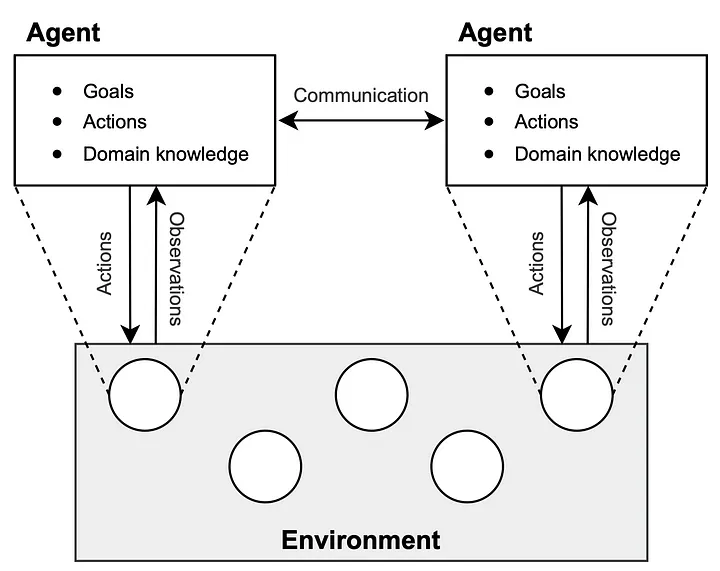
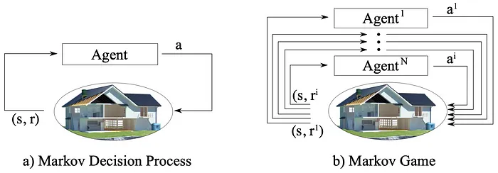
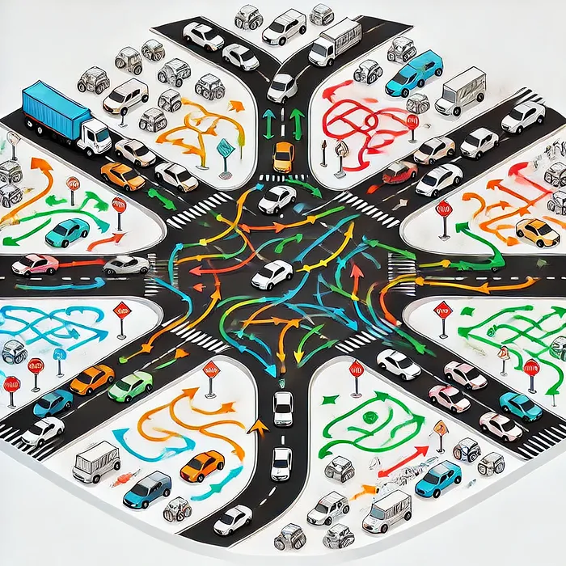
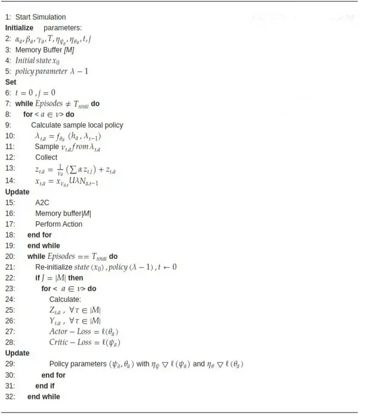
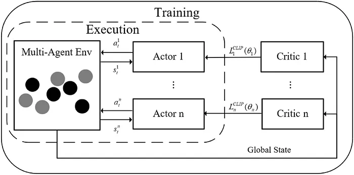
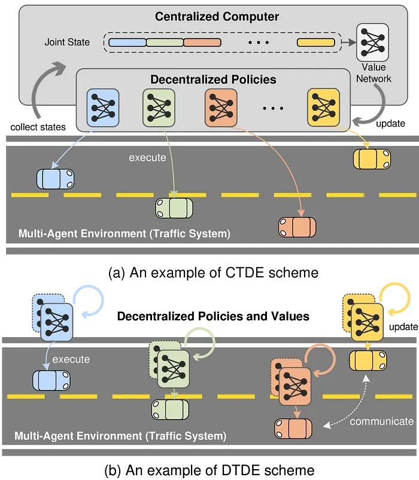
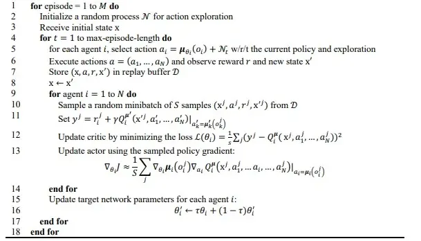
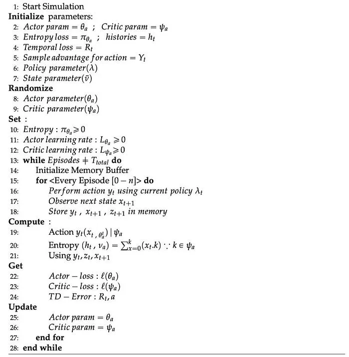

_As our cities grow and traffic congestion becomes an everyday hurdle, the quest for efficient traffic management solutions has never been more crucial. Imagine a world where traffic lights and vehicles communicate and adapt in real-time to ease congestion and reduce travel times. is stepping in to revolutionize autonomous traffic management, paving the way for smarter and more responsive urban mobility systems._

# **Introduction**

Autonomous driving systems are grabbing tons of attention and millions in funding from Industry, academia in recent years. The goal of such systems is to develop an efficient transportation system capable of replacing human drivers in order to reduce workload and improve safety and economy as a whole. We have already started to see commercial institutions like Waymo, Cruise, Zoox, Tesla etc. deploying their fully autonomous vehicle fleet on the roads of cities like San Francisco, Las Vegas, Dallas etc. and it's not long before we start to encounter these system in our daily commute all over the world.

Even though the present system can be termed as operationally safe they are far from being perfect and there have been Multiple cases of mishaps recorded in the past involving these cars. Improving traffic control is still a very active area of research and thanks to the advancement in Multi-Agent reinforcement Learning (MARL) we have achieved substantial breakthroughs in the area. MARL enables multiple sub-systems involved in traffic control to efficiently communicate with each other creating a robust solution to the problem.

# Problem Statement

Before moving ahead, it is important to understand what problem we are trying to solve. Autonomous driving is a complex task that requires a vehicle to navigate through a dynamic environment, avoiding obstacles and other vehicles while reaching its destination safely and efficiently. The vehicle must perceive its surroundings, predict the behavior of other agents, and make decisions in real-time to achieve its goals.

In the context of traffic management, the complexity further intensifies when we consider multiple autonomous vehicles, pedestrians, and traffic control elements all interacting simultaneously. Traditional traffic control systems rely on static rules and timed signal patterns, which often fail to adapt efficiently to unpredictable changes in traffic flow. This rigidity can lead to increased congestion, longer travel times, and higher emissions. The challenge, therefore, is to develop a dynamic and adaptive solution that allows all agents — vehicles, pedestrians, and traffic signals — to seamlessly coordinate with each other. By leveraging Multi-Agent Reinforcement Learning (MARL), we aim to create an intelligent system where each component learns and evolves in response to the environment, leading to improved overall traffic efficiency and safety in real time. This decentralized yet cooperative approach allows the system to handle the inherent uncertainties of urban traffic while optimizing flow and minimizing conflicts.

# Fundamentals of Multi-Agent Reinforcement Learning

Multi-Agent Reinforcement Learning (MARL) extends the concepts of traditional RL to environments with multiple agents. Each agent learns to make decisions based on its individual observations while considering interactions with other agents. MARL is typically formulated as a Markov Game, a multi-agent extension of the Markov Decision Process (MDP). In this setting, each agent has a policy that governs its actions, and the agents collectively influence the state of the environment. MARL is a branch of reinforcement learning that deals with environments where multiple agents operate simultaneously. Unlike traditional RL, where a single agent interacts with a static environment, MARL involves multiple agents that interact with both the environment and each other, creating more complex dynamics.

*Schematic of Multi-agent System. It consists of an environment and multiple decision-making agents (shown as circles inside the environment). The agents can observe information about the environment and take actions to achieve their goals.*

## Markov Game (Stochastic Game)

MARL is often modeled as a Markov Game, an extension of the Markov Decision Process (MDP) for multi-agent systems. Each agent (i) has its own policy (πi), which maps states to actions. The environment's state is influenced by the actions of all agents, and each agent receives individual rewards based on the joint action of all agents and the resulting state. This scenario becomes increasingly complicated when we are dealing with limited or incomplete information about the overall system. More particularly, an agent may not even be aware of the presence of other agents, making the environment non-stationary. Even in the case of complete information, learning a fully joint state-action space can be computational intractable with respect to the number of agents and the level of coordination required between them. There are many categorization schemes of Markov Games: independent learning versus joint action learning, general Markov games versus normal form games, continuous action space versus discrete action space etc.

*Illustration of the difference between a Markov Decision Process and a Markov Game. In (a) one agent and one environment are seen. The agent interacts with the environment by sending a tubule of actions and receiving one reward and the states of the environment. In (b) multiple agents and one environment are seen. The action space is split into i number of actions. Each agent receives a reward and the states of the environment.*

## Joint Policy and Interaction

In MARL, each agent needs to account for the behaviors of other agents, which makes the learning process interdependent. A joint policy π = (π1, π2, …, πn) defines the action-selection strategy for all agents. Agents must strike a balance between cooperation (if their goals align) and competition (if their goals conflict).

*A visualization for the interaction between agents in a multi-agent reinforcement learning environment with a focus on cooperation and competition at intersections.*

# Exploration & Exploitation

As in single-agent RL, each agent in MARL must explore the environment to discover better policies, but this becomes more challenging because other agents are also learning and adapting simultaneously. This dynamic changes the nature of the environment, making it non-stationary from any one agent's perspective.

## Types of MARL

1. **Cooperative MARL**: Agents share a common goal, such as maximizing the overall efficiency of a traffic network.
2. **Competitive MARL**: Agents have competing goals, such as individual vehicles aiming to minimize their own travel time, even at the expense of others.
3. **Mixed MARL**: Agents cooperate on some aspects but compete on others, such as vehicles coordinating at an intersection but competing on highway lane selection.

# MARL for Traffic Management

Now that the fundamentals of MARL have been established, lets look at how we can utilise it for the purpose of traffic control. Like mentioned earlier traffic management involves multiple subsystems like vehicles, traffic lights, pedestrians, signposts etc. making this an extremely non-linear problem. Sub-optimal decisions of any sort can easily have disastrous results and hence we cannot rely on heuristics based control approaches.

MARL is highly applicable to autonomous traffic management because the traffic environment involves multiple interacting agents, such as vehicles, pedestrians, and traffic lights. Each agent has its own goal (e.g., minimizing travel time), but they must also coordinate their actions to ensure the smooth functioning of the entire system.

There are multiple ways we could approach this problem and there have been multiple attempts involving MADDPG with recurrent actor critic, MA3C, PRIMAL etc. but two of the most popular algorithms are Multi-Agent Advantage Actor-Critic (MA2C) and Multi-Agent Proximal Policy optimization.

The **Multi-Agent Advantage Actor-Critic (MA2C)** algorithm adapts the traditional actor-critic reinforcement learning framework to environments with multiple interacting agents. Each agent — whether a traffic light or a vehicle — functions with its own "actor" and "critic." The actor decides on the best action to take (like adjusting signal timing or changing lanes) based on current observations, while the critic evaluates the action by estimating an "advantage" function, which reflects the expected improvement over the average outcome. Fig. below shows the MA2C algorithm for traffic control.

*MA2C Algorithm for MARL approach*

Initially, we set up parameters, states and policies for all agents. Each agent observes its local environment and uses a policy network to decide on the next action — such as changing a traffic light or adjusting speed — based on current observations and past experiences. Actions are taken to interact with the environment, and agents receive rewards that reflect the immediate impact on traffic flow, like reduced congestion or wait times. These experiences are stored in a memory buffer. Periodically, agents use the collected experiences to update their policy and value networks through the Advantage Actor-Critic (A2C) method, which optimizes their strategies by balancing exploration and exploitation. By continuously updating their policies and learning from the environment, the agents collaboratively improve traffic conditions over time without centralized control.

Another prominent algorithm employed in traffic control is the **Multi-Agent Proximal Policy Optimization (MAPPO)**. Similar to MA2C, MAPPO adapts a single-agent reinforcement learning algorithm — in this case, Proximal Policy Optimization (PPO) — to a multi-agent context. In traffic management scenarios, each agent, such as a traffic light or a vehicle, utilizes MAPPO to learn an optimal policy that not only benefits its individual performance but also contributes to the overall efficiency of the traffic network.

MAPPO operates by allowing each agent to interact with its local environment and make decisions based on observations like traffic density, queue lengths, or signal states. The key distinction of MAPPO lies in its use of a clipped surrogate objective, which constrains policy updates to a proximal region. This approach prevents drastic changes in the policy during training, enhancing the stability and reliability of learning. Agents collect experience data over multiple time steps, storing them in a memory buffer. They then perform policy updates using this batch of experiences, optimizing for cumulative rewards that reflect improvements in traffic flow, such as reduced waiting times and smoother vehicle movements.

*A representation of MAPPO*

By incorporating a mechanism to limit the extent of policy updates, MAPPO ensures that agents make incremental improvements without destabilizing the learned behaviors of other agents. This is particularly important in traffic systems where the actions of one agent can significantly impact others. Through iterative learning and coordination, agents using MAPPO can adapt to dynamic traffic conditions, leading to a more harmonious and efficient traffic management system without the need for centralized control.

Both MA2C and MAPPO exemplify how MARL algorithms can be tailored to address the complexities of autonomous traffic management. By enabling agents to learn and adapt their strategies in a shared environment, these algorithms contribute to reducing congestion, improving travel times, and enhancing the overall robustness of urban traffic systems.

# Alternative Approaches

The paper ["Multi-Agent Reinforcement Learning for Autonomous Driving: A Survey" by Ruiqi Zhang et al. (2024)](https://arxiv.org/html/2408.09675v1#S6) provides a comprehensive overview of the current state of multi-agent reinforcement learning (MARL) in autonomous driving. The paper takes an example scenario where multiple autonomous vehicles are approaching an intersection. Each vehicle has its own goals and constraints, such as reaching its destination quickly while avoiding collisions with other vehicles. The environment is dynamic, with other vehicles and pedestrians entering and exiting the intersection. Using MARL, we can develop a control policy for each vehicle that takes into account the actions of other vehicles and pedestrians. The policy can be trained using a combination of centralized and decentralized training methods.

The paper introduces two approaches namely Central Training and Decentralized Execution (CTDE) and Decentralized training Decentralized Execution (DTDE). To keep things simple CTDE basically means single policy is trained for all vehicles where as DTDE means individual policies are trained for each vehicle. Advantages of this approaches include but not limited to: Scalability, Partial Observability and Non-stationarity.

*The above figure makes it easy to visualize CTDE and DTDE. ([Ruiqi Zhang et al. (2024)](https://arxiv.org/html/2408.09675v1#S6))*

Some alternative algorithms that can also be applied to autonomous traffic management, though they may be more complex or condition-dependent are listed below:

1. **MADDPG (Multi-Agent Deep Deterministic Policy Gradient)**

**Multi-Agent Deep Deterministic Policy Gradient (MADDPG)** employs a decentralized approach for each agent while maintaining a shared critic network. In the context of traffic management, each agent — be it a traffic light, a vehicle, or even a pedestrian crossing — learns its policy by interacting with the environment independently. However, the critic network, which evaluates the actions of all agents, helps the system account for the interactions between different agents, leading to coordinated and more efficient decision-making.

The MADDPG algorithm begins with agents randomly exploring their actions, aided by a noise process to ensure varied exploration. As each agent takes actions, such as adjusting the traffic light duration or accelerating a vehicle, it observes the resulting reward and new state of the system, capturing the complex interdependencies in urban traffic. These experiences are stored in a replay buffer and periodically used to update the actor and critic networks. The actor focuses on selecting the best action based on the local state, while the critic evaluates this action by considering the joint state and actions of all agents, allowing for a better understanding of the cooperative aspects of traffic management. By leveraging these experiences through a combination of policy and value function updates, MADDPG helps agents adapt their behavior to achieve not only their individual goals (like minimizing wait time) but also the global goal of optimizing traffic flow.

*MADDPG Algorithm*

One of the distinguishing features of MADDPG is its use of centralized training and decentralized execution. During training, the critic utilizes information from all agents, providing a more holistic view of the entire traffic network. However, during real-time execution, each agent makes decisions independently based on its learned policy. This balance of centralized and decentralized strategies makes MADDPG well-suited for highly dynamic traffic systems, where real-time coordination is crucial but direct communication between all agents may not be feasible. As agents continue to learn and refine their policies, MADDPG contributes to a coordinated approach to traffic management, reducing congestion and promoting smoother traffic movement across the system.

**2\. Independent Advantageous Actor-Critic (IA2C) Algorithm for MARL**

*Independent Advantage Actor Critic Algorithm*

This algorithm is an extension of the actor-critic method, where each agent learns independently but still benefits from the feedback of a critic to improve decision-making.

In the Independent Advantageous Actor-Critic (IA2C) algorithm, the process begins by initializing key parameters, including the actor's policy parameters θaθa and the critic's value function parameters ψaψa, along with an entropy term to promote exploration. In this project, **Simulation of Urban Mobility (SUMO)** is used to create a realistic traffic environment where each vehicle, acting as an independent agent, navigates through traffic with the goal of optimizing flow and reducing congestion. Each vehicle learns independently, which means it doesn't rely on centralized coordination and can adapt to its own local environment, allowing the system to scale effectively.

During training, a memory buffer stores each agent's experiences, which consist of the actions they take, the states they observe, and the rewards they receive. At every time step, the agents use their current policy to select an action based on the state of the environment. After performing the action, the agent observes the new state and receives feedback in the form of a reward, which indicates how well the action reduced traffic congestion or achieved other desired outcomes.

The critic then steps in to evaluate the action by calculating the **Temporal Difference (TD) error**, which measures the difference between the predicted reward and the actual reward the agent received. The critic's role is crucial, as it provides feedback to the actor on how well the actions are aligned with long-term rewards. To encourage exploration, the algorithm uses an entropy term. This ensures that agents do not get stuck in a local optimum by always choosing the same actions, but instead explore a variety of strategies to find more effective solutions.

The actor's loss is then computed based on how well its chosen action maximized rewards, which is used to update its policy parameters θaθa for better future decision-making. Simultaneously, the critic's loss is calculated by comparing the TD error, and the critic's parameters ψaψa are updated to improve its estimation of future rewards. This dual update of both actor and critic parameters enables each agent to continuously refine its strategies.

Over multiple episodes, this iterative learning process allows the agents to converge toward optimal policies. By interacting with the dynamic traffic environment, observing outcomes, and adjusting their actions, the agents eventually learn effective strategies for managing traffic autonomously, improving flow, and reducing congestion over time. This decentralized approach, using IA2C, is particularly effective for real-time, large-scale environments like traffic management.

# Summary

In conclusion, Multi-Agent Reinforcement Learning (MARL) offers a promising approach to managing the complexities of autonomous traffic systems, transforming static and rigid traffic control into a dynamic and adaptive system. By allowing multiple agents, such as vehicles and traffic lights, to interact and learn from their environment in a decentralized yet cooperative manner, MARL algorithms like MA2C, MAPPO, and MADDPG are paving the way for more efficient, resilient, and scalable urban traffic management solutions. Through the application of advanced algorithms and cooperative strategies, MARL has the potential to significantly reduce congestion, improve travel times, and create a safer and more responsive urban mobility landscape.

I would like to thank Suraj Kalwaghe and Tanmay Pancholi for contributing in writing of this article.

# References

1. M. Brittain and P. Wei, "Autonomous separation assurance in an high density enroute sector: A deep multi-agent reinforcement learning approach," in 2019 IEEE Intelligent transportation Systems Conference (ITSC), pp. 3256–3262, 2019.

2. J. Yang, J. Zhang, and H. Wang, "Urban traffic control in software defined internet of things via a multi-agent deep reinforcement learning approach," IEEE Transactions on Intelligent Transportation Systems, vol. 22, no. 6, pp. 3742–3754, 2021.

3. Ruiqi Zhang, Jing Hou, Florian Walter, Shangding Gu, Jiayi Guan, Florian Röhrbein, Yali Du, Panpan Cai, Guang Chen, Alois Knoll (2024). _Multi-Agent Reinforcement Learning for Autonomous Driving: A Survey_. arXiv.

4. Yang, Y., Hao, J., Zheng, Y., & Cai, H. (2023). _Multi-agent reinforcement learning: Foundations and Modern Approaches._